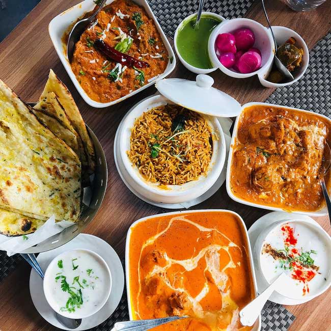
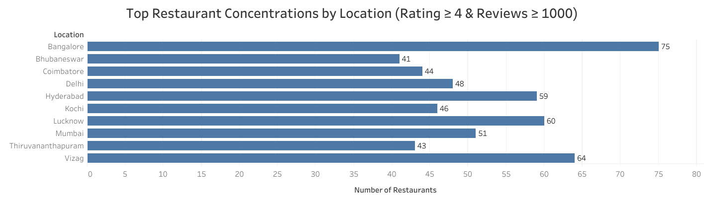
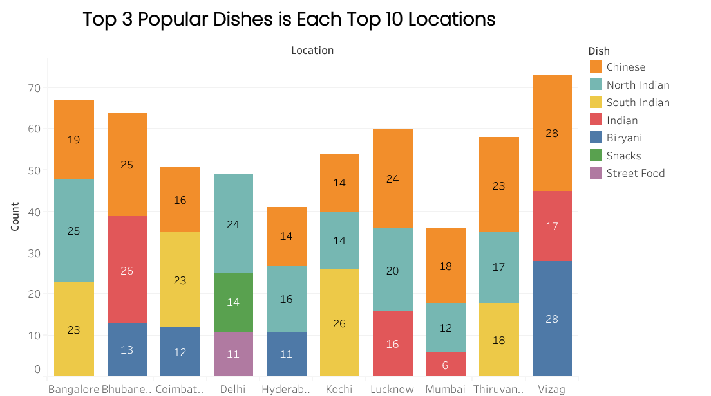
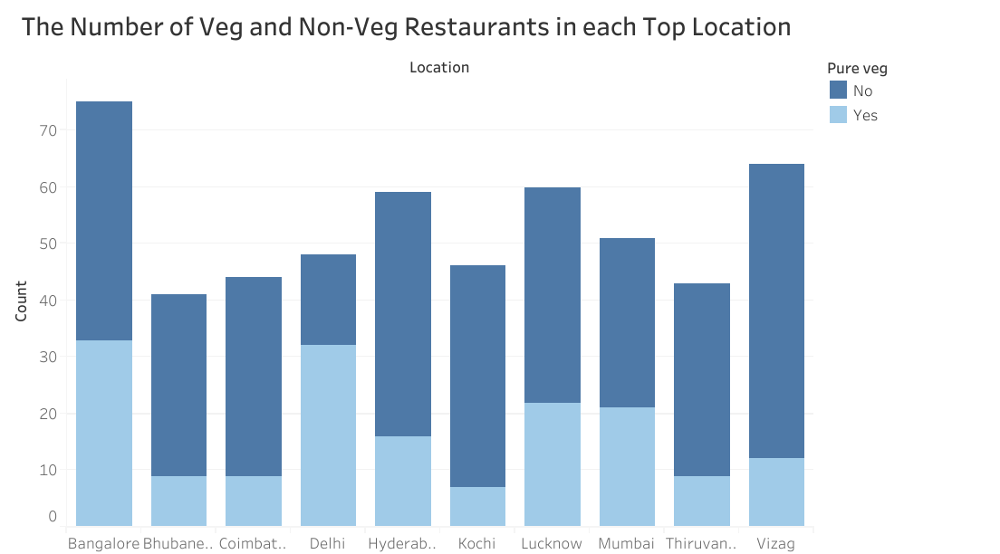
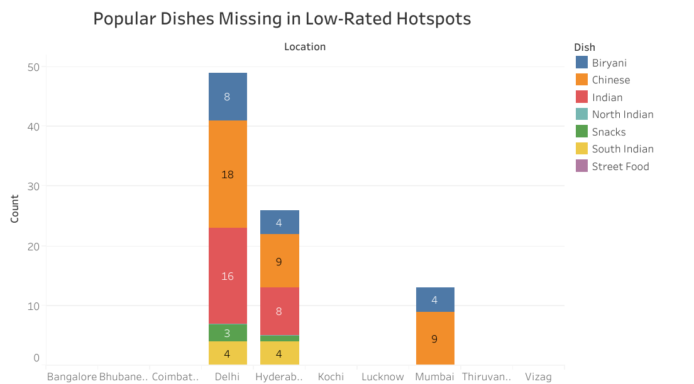

# Finding the Perfect Spot: Restaurant Trends & Insights from Swiggy Dataset





### Project overview:
This project aims to uncover data-driven insights to identify the best potential areas to start a new restaurant. Using Swiggy public dataset, i analyzed restaurant ratings, popular dishes, and veg/non-veg preferences across top 10 high-density locations.

Tools Used: R Programming (data analysis), Tableau (visualization)

#### Loading Packages
```r 
library(tidyverse)
library(ggplot2)
library(janitor)
library(skimr)
library(here)
```

 
### Data Importing, Cleaning & Exploring. 
####   Importing the Dataset
   
For this project i used Swiggy public [Data](https://www.kaggle.com/datasets/rrkcoder/swiggy-restaurants-dataset)

```{r message=FALSE, warning=FALSE}
swiggy <- read_csv(here('data','swiggy_file.csv'))
```


#### Cleaning the Data

As the part of data preparation for analysis, I performed the following cleaning steps.

- Renamed columns for better readability and consistency.
- Converted the 'Rating' & 'Number_of_Ratings' columns to integer format to enable numerical analysis.
- Combined the two 'Cuisines' columns into a single column to simplify further exploration.

```{r message=FALSE, warning=FALSE}
#Renaming the columns.

swiggy <-  swiggy %>%  rename( Restaurant_Name = `Restaurant Name`) %>% 
  rename(Number_of_Ratings = `Number of Ratings`) %>% 
  rename(Average_price = `Average Price`) %>% 
  rename(Number_of_offers = `Number of Offers`) %>% 
  rename(Offer_Name = `Offer Name`) %>% 
  rename(Pure_veg = `Pure Veg`)

#Convert 'Rating' & 'Number_of_Ratings' to integer.

swiggy$Rating <- as.integer(swiggy$Rating) 
  
swiggy$Number_of_Ratings <- gsub("ratings","",swiggy$Number_of_Ratings)
swiggy$Number_of_Ratings <- gsub("\\+","",swiggy$Number_of_Ratings)
swiggy$Number_of_Ratings <- trimws(swiggy$Number_of_Ratings)
swiggy$Number_of_Ratings <- gsub("K", "000", swiggy$Number_of_Ratings)

swiggy$Number_of_Ratings <- as.integer(swiggy$Number_of_Ratings)

#combining 'Cuisines'.

 swiggy_cleaned <- swiggy %>% 
   separate_wider_delim(Cuisine,",",names= c("dish1", "dish2"), too_few = "debug") 

```

#### Exploring the Data

### **Top Locations with Higher Rated Restaurants**

To identify the best-performing areas, I filtered the data based on the following conditions:

- Rating >= 4.
- Number_of_Ratings >= 10000.

This helped me focus on restaurants that are not only well-rated but also have a high volume of customer feedback.

```{r message=FALSE, warning=FALSE}
higher_rated_restaurants <- swiggy_cleaned %>%
  filter(Rating >= 4, Number_of_Ratings >= 10000) %>% group_by(Location) %>%  drop_na()
 view(higher_rated_restaurants)
```
From this filtered dataset, i identified the **Top 10** locations with highest number of high performing restaurants. 

```{r message=FALSE, warning=FALSE}
Top_10_location <- higher_rated_restaurants %>%  summarise(count = n(), avg_rating= mean(Rating),
       avg_no_rating = mean(Number_of_Ratings)) %>% arrange(desc(count)) %>% 
  slice_head(n = 10)
```




### **Popular Dishes in Top Locations**

To identify which dishes are most frequently served in the top 10 high-rated and high-density locations, helping us understand regional food preferences and spot popular menu items.


```{r message=FALSE, warning=FALSE}
Filtered_df <- higher_rated_restaurants %>% filter(Location %in% Top_10_location$Location)
 
#Combine dish1 and dish2 
Combined_dishes <- Filtered_df %>%
  select(dish1, dish2) %>%
  pivot_longer(cols = c(dish1, dish2), names_to = "Dish_Type", values_to = "Dish") %>%
  mutate(Dish = str_trim(Dish)) %>%
  filter(!is.na(Dish), Dish != "") 
 
Popular_dishes_3 <- Combined_dishes %>%
  group_by(Location,Dish) %>%
  summarise(Count = n()) %>%
  arrange(desc(Count)) %>% slice_head(n = 3)

```




- Each top location has its own set of most-served dishes, reflecting local demand.
- Some dishes like "Chinese" and "North Indian" appear across multiple locations, hinting at pan-regional popularity.
- These insights can guide menu planning for new restaurants in each area.

### **Veg v/s Non-Veg Restaurant Distribution**

By summarizing the data across all restaurants, I examined the distribution and performance of veg and non-veg restaurants:

```{r message=FALSE, warning=FALSE}
swiggy %>% group_by(Pure_veg) %>% summarise(avg_rat = mean(Rating,na.rm = TRUE), count = n())
```


- There are 59,163 *pure vegetarian* restaurants with an average rating of **3.65**.
- There are 81,498 *non-vegetarian* restaurants with an average rating of **3.64**.

Despite the slight difference in count, the ratings are almost the same. This suggests that restaurant ratings are not significantly influenced by whether the food is veg or non-veg—what matters most is the quality of service and food, not the category.


```{r message=FALSE, warning=FALSE}
pv_1  <- Filtered_df %>% group_by(Location, Pure_veg) %>%  summarise(count = n()) %>% 
  arrange(Location)
```


- Grouped the data by the Pure_veg column and Location.
- Counted the number of veg and non-veg restaurants per top location.
- Visualized the distribution using a side-by-side bar chart to highlight regional dietary preferences.




Some locations show a clear dominance of non-veg restaurants, while others maintain a balanced or veg-heavy mix.


### **Popular Dishes Missing in Low-Rated Areas within Top Locations**

To uncover business opportunities by identifying popular dishes from highly-rated restaurants that are not being offered in low-rated areas within the top 10 restaurant-dense locations.

- Focused on restaurants with rating <= 1/
- Grouped by Location and Area.
- Identified low rated areas within top locations.
- Compared top dishes in highly-rated restaurants vs. dishes available in the above low-rated hotspots.
- Found that many high-demand dishes are missing from the low-rated areas.

```{r message=FALSE, warning=FALSE}
low_rated_restaurants <- swiggy_cleaned %>% filter(Rating <= 1) %>% 
group_by(Location) %>% drop_na() 

low_rated_areas_in_top_locations <- low_rated_restaurants %>% 
filter(Location %in% Top_10_location$Location) %>% group_by(Area)

Dishes_in_low_rated_areas<- low_rated_areas_in_top_locations %>%  
select(dish1, dish2, Area, Location) %>%
pivot_longer(cols = c(dish1, dish2), names_to = "Dish_Type", values_to = "Dish") %>%
mutate(Dish = str_trim(Dish)) %>%
filter(!is.na(Dish), Dish != "")
 
Top_Dishes_in_low_rated_areas <- Dishes_in_low_rated_areas %>% 
filter( Dish %in% Popular_dishes_3$Dish)
 
low_rated_counts <- Dishes_in_low_rated_areas %>% filter(Dish %in% Popular_dishes_3$Dish) %>% 
group_by(Dish) %>% summarise(count = n()) %>% arrange(count)
  
missing_dishes <- setdiff(low_rated_counts$Dish, Popular_dishes_3$Dish)
  
full_combo <- expand.grid(
Location = Top_10_location$Location,
Dish = Popular_dishes_3$Dish,
stringsAsFactors = FALSE)
 
dish_counts <- Dishes_in_low_rated_areas %>%
filter(Location %in% full_combo$Location, Dish %in% full_combo$Dish) %>%
group_by(Location, Dish) %>%
summarise(count = n(), .groups = "drop")
 
final_result <- full_combo %>%
left_join(dish_counts, by = c("Location", "Dish")) %>%
replace_na(list(count = 0))  
 
 
 
```



#### Key Insights

- Dishes like Biryani, Indian, Chinese, and South Indian are served in some restaurants in low rated areas in top   location.
- However, they are absent n several low rated sub areas like:
     - Bangalore(BTM)
     - Chennai(Urapakkam)
     - Pune(Wakad)

This suggests that poor customer ratings may be linked to the absence of trending dishes, rather than just overall quality.

#### **Business Opportunity**
There’s a clear gap in the market within top locations.
Introducing popular high-rated dishes in low-performing areas could improve customer satisfaction and boost restaurant performance.
Whether a restaurant is a veg or non-veg,or located in a high density hotspot, its success ultimately depends on the quality it delivers.
This analysis proves that strategic placement, menu choices, and quality focus can together define the roadmap for launching a successful restaurant.

This is my second completed data analytics project using R. **Thank you** for exploring this project.
